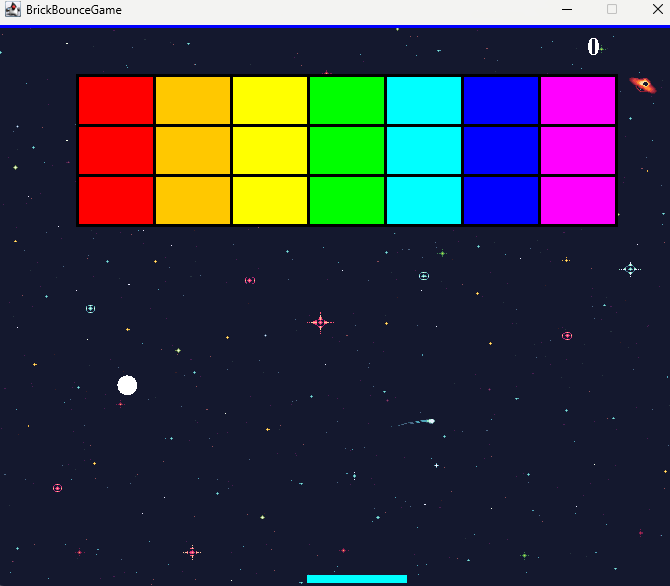

# Brick_Bounce_Game 🎮

BrickBounceGame is a simple Java-based arcade game inspired by classic brick-breaking games like Breakout. The game involves controlling a paddle to bounce a ball and destroy bricks on the screen. The game ends when the ball falls below the screen or when all bricks are cleared.

## Features ✨

- 🌌 Dynamic background image (space-themed)
- 🌈 Colorful bricks with a rainbow color scheme
- 🏆 Scoring system with a restart option upon game completion
- ⬅️➡️ Controls for moving the paddle left and right
- ⏰ A timer that updates the game state

## Screenshots 📸



## Requirements 📦

- 🖥️ JDK 8 or later
- Java Swing for GUI components

## Setup ⚙️

### 1. Clone the repository
```bash
git clone https://github.com/your-username/BrickBounceGame.git
cd BrickBounceGame
```
### 2. Compile the Java code
To compile the game, run:
```bash
javac Main.java Gameplay.java Map.java
```
## Controls 🎮
- ⬅️ **Left Arrow**: Move the paddle left
- ➡️ **Right Arrow**: Move the paddle right
- ↩️ **Enter**: Restart the game after winning or losing

## Classes Overview 🗂️
### `Main.java`
The main class that creates the game window and initializes the gameplay.

### `Gameplay.java`
Handles game mechanics, such as rendering the game objects (paddle, ball, bricks) and handling key events (player input). It also manages the game state (play, win, game over).

### `Map.java`
Handles the creation and drawing of the brick map, including brick destruction and collision detection.

## License 📝
This project is licensed under the MIT License - see the LICENSE file for details.

## Acknowledgements 🙏
- The game was built using Java's Swing library.
- Special thanks to online tutorials and resources that helped with game development and GUI setup.
